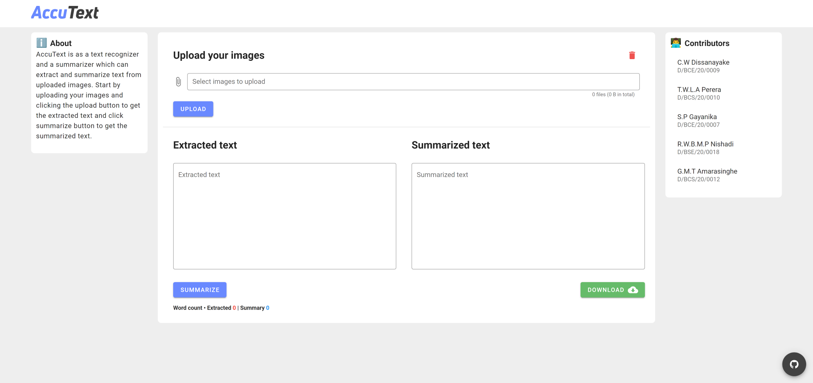
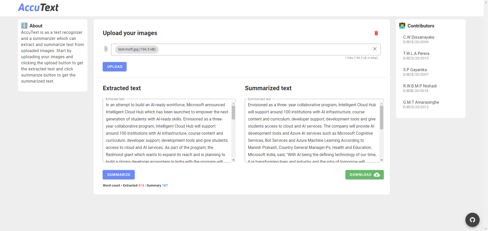

## User Interface Preview
- User interface of initial page.

- User interface while in use.

## Server Installation
### Required packages in Python (3.6+) environment
- networkx
- nltk
- numpy
- opencv-python
- pytesseract
- python-dotenv
- quart
- Quart-CORS
- scipy

### Required third party software
- Tesseract OCR engine

### Installation

- Python packages using pip

        python -m pip install networkx nltk numpy opencv-python pytesseract python-dotenv quart Quart-CORS scipy

- Installing Tesseract OCR engine

    - [Download Link](https://digi.bib.uni-mannheim.de/tesseract/tesseract-ocr-w64-setup-v5.0.1.20220107.exe)

    - Install to the default location (Recommended)

            C:\\Program Files\\Tesseract-OCR\\tesseract.exe

    - Or change the value of `TESSERACT` in `.env` file accordingly.

### Running the server

- Enter the follwing command in `server` directory:

        python server.py

- Configured to run on `PORT 5000` by default.

- `PORT` can be changed via `.env`. Important: client `.env` must be edited accordingly.

- Visit http://127.0.0.1:5000/api/ to test the server.

- Visit http://127.0.0.1:5000/api/test/ocr and http://127.0.0.1:5000/api/test/summary to test both engines.

## Client installation

- Use a simple web server to serve `dist` folder in `client` directory.

- For example execute `python -m http.server` inside `dist` to serve the files of the directory. And visit the given link (i.e.`http://localhost:8000/`) to access the web client.